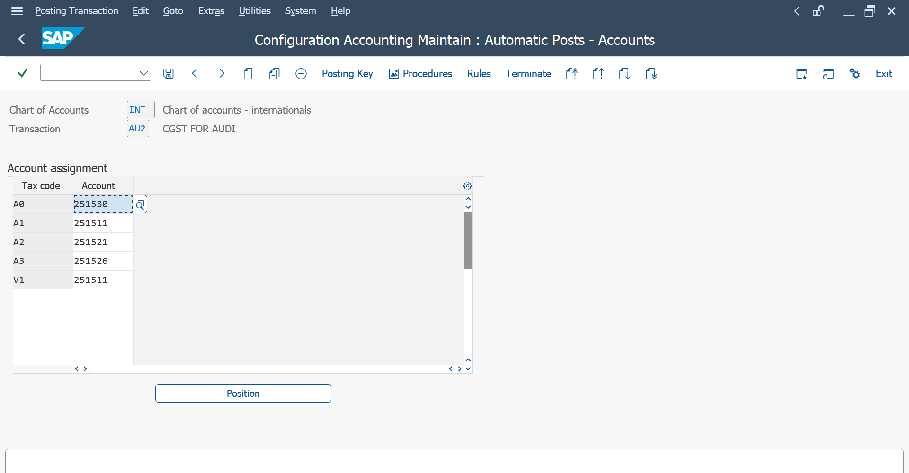

# Automatic Account Assignment

## Definition

Automatic Account Assignment in SAP MM is the process of determining the appropriate G/L account automatically during accounting postings based on the configured transaction and account determination settings.

## Transaction Code

**T-Code:** `OB40`

## Procurement Flow

**Purchase Order → Goods Receipt (MIGO) → Invoice Verification (MIRO) → Automatic G/L Account Determination → Accounting Document**

## Purpose

Automatic account assignment helps SAP determine the correct G/L accounts automatically during relevant accounting transactions.

This reduces manual account selection and ensures that postings are made to the appropriate accounts.

## Automatic Account Assignment Process

1. Configure the required tax-related transaction keys.
2. Assign the appropriate G/L accounts.
3. Maintain the required tax code settings.
4. Perform the relevant purchasing transaction.
5. SAP determines the configured G/L account automatically.
6. Verify the resulting accounting document.

## Transaction Keys

### AU1 – SGST

The transaction key `AU1` is used for the SGST-related account assignment in this practice scenario.

### AU2 – CGST

The transaction key `AU2` is used for the CGST-related account assignment in this practice scenario.

## Account Assignment

| Transaction Key | Description |
|---|---|
| `AU1` | SGST |
| `AU2` | CGST |

## Key Information

- Chart of Accounts
- Transaction Key
- Tax Code
- G/L Account
- Tax Type
- Tax Rate
- Account Assignment

## Practical Configuration

The following tax-related transaction keys were configured with their respective G/L accounts:

- `AU1` – SGST
- `AU2` – CGST

These account assignments are used by SAP during the relevant tax posting process.

## Screenshots

### AU1 – SGST Automatic Posting

### AU2 – CGST Automatic Posting

