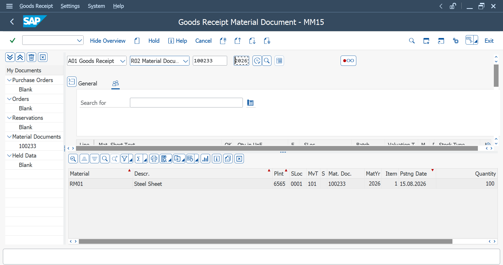

# Goods Receipt (MIGO)

## Definition

Goods Receipt (GR) in SAP MM is the process of recording the receipt of materials against a Purchase Order.

## Transaction Code

**T-Code:** `MIGO`

## Procurement Flow

**Purchase Requisition → RFQ → Quotation → Vendor Comparison → Purchase Order → Goods Receipt (MIGO) → Stock Check (MMBE) → Invoice Verification (MIRO)**

## Purpose

MIGO is used to post goods movements in SAP, including the receipt of materials against a Purchase Order.

## Goods Receipt Process

1. Execute transaction code `MIGO`.
2. Select the appropriate goods receipt transaction.
3. Enter the Purchase Order number.
4. Check the material and quantity.
5. Verify the Plant and Storage Location.
6. Check the movement type.
7. Review the goods receipt details.
8. Post the goods receipt.
9. SAP generates a Material Document for the posted goods movement.

## Key Information

- Purchase Order Number
- Material Number
- Material Description
- Quantity
- Plant
- Storage Location
- Movement Type
- Posting Date
- Document Date
- Material Document Number

## Material Document

After posting the Goods Receipt, SAP generates a **Material Document** that records the goods movement.

The Material Document provides a reference for the posted goods receipt and can be used to review the material movement.

## Stock Impact

After a successful Goods Receipt, the received quantity is updated in the relevant stock according to the posting.

The stock can be checked using transaction code `MMBE`.

## Related Transaction Codes

| Activity | Transaction Code |
|---|---|
| Goods Receipt | `MIGO` |
| Display Material Document | `MB03` |
| Stock Overview | `MMBE` |

## Screenshots

### Goods Receipt – MIGO

### MIGO History

