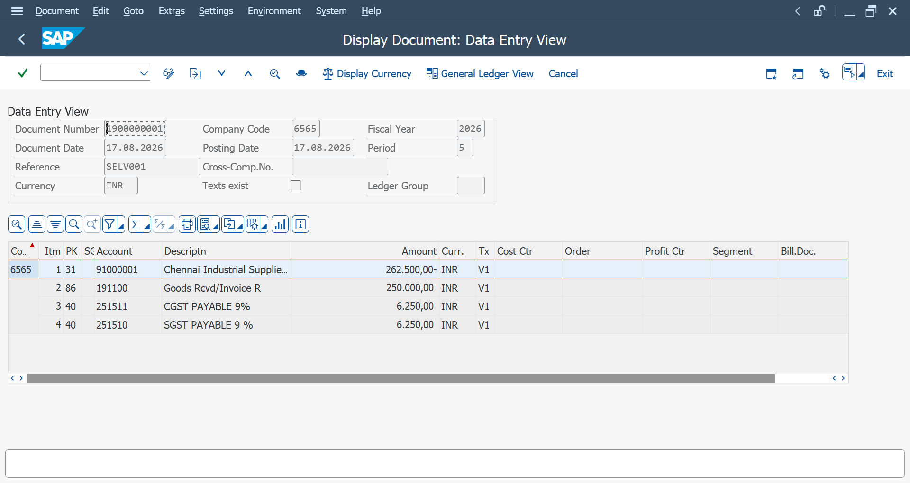

# Invoice Verification (MIRO)

## Definition

Invoice Verification in SAP MM is the process of checking and posting a vendor invoice against the related Purchase Order and Goods Receipt.

## Transaction Code

**T-Code:** `MIRO`

## Procurement Flow

**Purchase Requisition → RFQ → Quotation → Vendor Comparison → Purchase Order → Goods Receipt (MIGO) → Invoice Verification (MIRO) → Accounting Document**

## Purpose

MIRO is used to record the vendor invoice and verify it against the corresponding Purchase Order and Goods Receipt.

## Invoice Verification Process

1. Execute transaction code `MIRO`.
2. Select the appropriate invoice transaction.
3. Enter the invoice date.
4. Enter the reference or vendor invoice number.
5. Enter the invoice amount.
6. Enter the Purchase Order number.
7. Check the Purchase Order and Goods Receipt details.
8. Verify the tax information.
9. Check the invoice balance.
10. Post the invoice.
11. SAP generates an Accounting Document for the invoice posting.

## Key Information

- Invoice Date
- Posting Date
- Vendor
- Purchase Order Number
- Reference
- Invoice Amount
- Currency
- Tax Code
- Tax Amount
- Payment Terms
- Company Code

## Invoice Verification

During invoice verification, SAP checks the invoice against the purchasing documents and the received quantity.

The invoice can be posted when the relevant details are correctly maintained and the document is balanced.

## Accounting Document

After posting the invoice, SAP creates an Accounting Document.

The accounting document records the financial impact of the vendor invoice, including the vendor liability, expense or GR/IR posting, and applicable tax postings.

## Practical Example

**Purchase Order:** `4500022753`

**Vendor:** Chennai Industrial Supplies Pvt Ltd

**Invoice:** `159 / 2026`

**Invoice Amount:** `262,500 INR`

**Tax Amount:** `12,500 INR`

The invoice was verified against the Purchase Order and Goods Receipt before posting.

## Screenshots

### MIRO Invoice

### Accounting Document – MIRO

